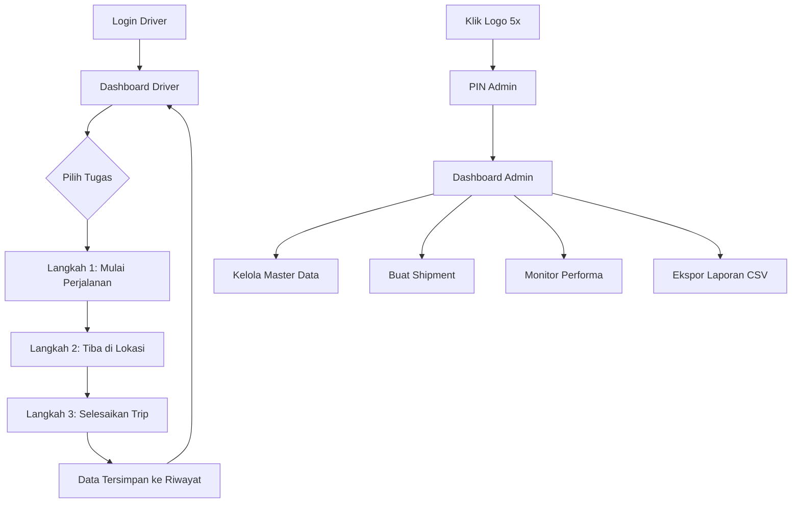

# 📘 User Guide - Sistem Ritase Ivory

**Versi:** 1.0  
**Terakhir Diperbarui:** 30 Juni 2026  
**Aplikasi:** Sistem Pelacakan dan Perhitungan Ritase Supir Mobil Tanki

---

## 📋 Daftar Isi

1. [Pendahuluan](#1-pendahuluan)
2. [Persyaratan Sistem](#2-persyaratan-sistem)
3. [Instalasi & Akses Aplikasi](#3-instalasi--akses-aplikasi)
4. [Alur Kerja Aplikasi](#4-alur-kerja-aplikasi)
5. [Panduan Driver (Pengemudi)](#5-panduan-driver-pengemudi)
   - [5.1 Login Driver](#51-login-driver)
   - [5.2 Dashboard Driver](#52-dashboard-driver)
   - [5.3 Langkah 1: Mulai Perjalanan](#53-langkah-1-mulai-perjalanan)
   - [5.4 Langkah 2: Tiba di Lokasi](#54-langkah-2-tiba-di-lokasi)
   - [5.5 Langkah 3: Selesaikan Trip](#55-langkah-3-selesaikan-trip)
   - [5.6 Riwayat Pengiriman](#56-riwayat-pengiriman)
6. [Panduan Admin](#6-panduan-admin)
   - [6.1 Akses Panel Admin](#61-akses-panel-admin)
   - [6.2 Dashboard Statistik](#62-dashboard-statistik)
   - [6.3 Buat Shipment / Tugas](#63-buat-shipment--tugas)
   - [6.4 Monitoring Tugas & Status](#64-monitoring-tugas--status)
   - [6.5 Konfigurasi Tarif & Biaya](#65-konfigurasi-tarif--biaya)
   - [6.6 Master Data Mobil Tanki](#66-master-data-mobil-tanki)
   - [6.7 Master Data AMT](#67-master-data-amt-awak-mobil-tanki)
   - [6.8 Riwayat & Ekspor Data](#68-riwayat--ekspor-data)
   - [6.9 Performance Monitor](#69-performance-monitor)
7. [Fitur Kamera Real-time](#7-fitur-kamera-real-time)
8. [Sinkronisasi Firebase](#8-sinkronisasi-firebase)
9. [Fitur PWA (Progressive Web App)](#9-fitur-pwa-progressive-web-app)
10. [FAQ & Troubleshooting](#10-faq--troubleshooting)

---

## 1. Pendahuluan

**Sistem Ritase Ivory** adalah aplikasi web Progressive Web App (PWA) yang dirancang untuk melacak dan menghitung ritase pengiriman BBM oleh supir mobil tanki. Aplikasi ini memungkinkan:

- ✅ **Pelacakan GPS real-time** posisi supir saat mulai, tiba, dan menyelesaikan perjalanan
- ✅ **Dokumentasi foto** di setiap tahap pengiriman (TBBM, lokasi tujuan, struk BBM, struk tol)
- ✅ **Verifikasi wajah driver** (selfie) di setiap langkah untuk validasi identitas
- ✅ **Perhitungan otomatis** uang makan, uang ritase, dan total biaya
- ✅ **Sinkronisasi cloud** real-time via Firebase Firestore
- ✅ **Mode offline** dengan penyimpanan data lokal
- ✅ **Panel Admin** untuk monitoring armada dan manajemen master data
- ✅ **Ekspor data CSV** untuk pelaporan

> [!TIP]
> Aplikasi ini dirancang sebagai PWA sehingga bisa diinstal di perangkat Android/iOS layaknya aplikasi native, dan tetap berfungsi secara offline.

---

## 2. Persyaratan Sistem

| Komponen | Kebutuhan Minimum |
|---|---|
| **Browser** | Google Chrome 90+, Safari 14+, Firefox 88+, Edge 90+ |
| **OS** | Android 8+, iOS 14+, Windows 10+, macOS 11+ |
| **Koneksi** | Internet (untuk sinkronisasi cloud), bisa offline mode |
| **Hardware** | Kamera (untuk foto & selfie), GPS (untuk pelacakan lokasi) |
| **Penyimpanan** | Min. 50 MB ruang kosong |

> [!IMPORTANT]
> Pastikan izin **Kamera** dan **Lokasi (GPS)** diaktifkan di pengaturan browser Anda untuk menggunakan semua fitur aplikasi.

---

## 3. Instalasi & Akses Aplikasi

### Akses via Browser
1. Buka browser (Chrome direkomendasikan)
2. Ketik URL aplikasi Sistem Ritase Ivory
3. Aplikasi akan otomatis dimuat

### Instalasi sebagai PWA (Rekomendasi)
1. Buka aplikasi di browser Chrome
2. Ketuk ikon **menu (⋮)** di pojok kanan atas
3. Pilih **"Instal Aplikasi"** atau **"Tambahkan ke Layar Utama"**
4. Konfirmasi instalasi
5. Ikon "Sistem Ivory" akan muncul di layar utama perangkat Anda

> [!TIP]
> Menginstal sebagai PWA memberikan pengalaman lebih baik: layar penuh, akses offline, dan notifikasi tugas.

---

## 4. Alur Kerja Aplikasi

Berikut adalah diagram alur kerja keseluruhan aplikasi:

### Ringkasan Alur:

---

## 5. Panduan Driver (Pengemudi)

### 5.1 Login Driver

Saat pertama kali membuka aplikasi, Anda akan melihat halaman **Verifikasi Driver**. Tersedia dua metode login:

#### Metode 1: Login via Nomor Telepon
1. Pastikan tab **"No. Telepon"** aktif (berwarna biru)
2. Masukkan **nomor telepon** yang terdaftar di sistem (contoh: `081234567890`)
3. Klik tombol **"Masuk"**
4. Sistem akan mencocokkan nomor telepon dengan database AMT

#### Metode 2: Login via Verifikasi Wajah
1. Klik tab **"Verifikasi Wajah"**
2. Pilih nama driver dari dropdown **"Pilih Driver"**
3. Klik tombol **"Aktifkan Kamera & Pindai"**
4. Posisikan wajah Anda di area pemindaian
5. Sistem akan memverifikasi wajah secara otomatis

> [!NOTE]
> Nomor telepon harus sesuai dengan data yang telah didaftarkan oleh Admin di Master Data AMT. Hubungi Admin jika belum terdaftar.

---

### 5.2 Dashboard Driver

Setelah berhasil login, Anda akan masuk ke **Dashboard Driver** yang menampilkan:

| Elemen | Keterangan |
|---|---|
| **Profil Header** | Foto, nama driver, dan tombol Logout |
| **Indikator Trip Aktif** | Peringatan hijau jika ada perjalanan yang belum selesai |
| **Daftar Tugas Masuk** | Kartu-kartu tugas yang dikirim oleh Admin |

#### Memulai Tugas:
1. Lihat daftar tugas yang tersedia
2. Setiap kartu tugas menampilkan: **No. DO/SO**, **Produk**, **Volume**, **Kota Tujuan**
3. Klik tombol **"Mulai"** pada tugas yang ingin dikerjakan
4. Form "Langkah 1" akan tampil otomatis dengan data terisi dari tugas

#### Tombol Logout:
- Klik tombol **"Logout"** merah di pojok kanan atas profil untuk keluar

---

### 5.3 Langkah 1: Mulai Perjalanan

Setelah memilih tugas, form **Langkah 1** akan muncul. Berikut detail pengisiannya:

#### Field yang Terisi Otomatis (dari Tugas):
| Field | Keterangan |
|---|---|
| **Tanggal Pengiriman** | Otomatis terisi tanggal hari ini |
| **No. DO** | Nomor Delivery Order dari tugas |
| **No. SO** | Nomor Sales Order dari tugas |
| **Produk** | Jenis produk BBM (Bio Solar, Dexlite, dll.) |
| **Quantity (Liter)** | Volume BBM dalam liter |
| **Kota Tujuan** | Kota tujuan pengiriman |
| **Tujuan Pengiriman** | Alamat lengkap SPBU/Konsumen |

#### Field yang Harus Diisi Manual:
| Field | Keterangan | Wajib? |
|---|---|---|
| **No. Polisi Kendaraan** | Pilih nomor polisi MT dari dropdown | ✅ Ya |
| **Nama AMT 1 (Supir)** | Otomatis terisi sesuai login | ✅ Ya |
| **Nama AMT 2 (Kernet)** | Pilih kernet dari dropdown | ✅ Ya |
| **Odometer Awal** | Input angka odometer saat ini (dalam km) | ✅ Ya |
| **Foto di TBBM** | Ambil foto kendaraan di TBBM | ✅ Ya |
| **Selfie Wajah Driver** | Ambil selfie untuk verifikasi | ✅ Ya |

#### Cara Mengambil Foto:
1. Klik tombol **"Ambil Foto Kamera (Real-time)"**
2. Modal kamera akan terbuka
3. Arahkan kamera ke objek/wajah
4. Klik tombol **capture** (lingkaran putih)
5. Foto akan tampil di preview box

#### Menyelesaikan Langkah 1:
1. Pastikan semua field wajib (*) telah terisi
2. Klik tombol **"Mulai Perjalanan"**
3. GPS akan otomatis merekam lokasi TBBM
4. Aplikasi akan berpindah ke **Langkah 2**

> [!WARNING]
> Pastikan GPS aktif! Lokasi TBBM akan direkam secara otomatis saat Anda menekan tombol "Mulai Perjalanan".

---

### 5.4 Langkah 2: Tiba di Lokasi

Setelah tiba di lokasi tujuan, lakukan langkah-langkah berikut:

#### Ringkasan Perjalanan (di bagian atas):
Kartu ringkasan menampilkan data perjalanan Anda:
- **DO / SO** - Nomor dokumen pengiriman
- **Tujuan** - Alamat tujuan
- **Odo Awal** - Odometer saat mulai
- **Mulai Trip** - Waktu mulai perjalanan

#### Dokumentasi Kedatangan:

| Foto yang Harus Diambil | Keterangan |
|---|---|
| **Foto Tiba di Lokasi** | Foto kendaraan di lokasi tujuan |
| **Selfie Wajah Driver di Tujuan** | Selfie untuk verifikasi kehadiran |
| **Foto Bukti Serah Terima Dokumen** | Foto surat jalan/dokumen serah terima |

#### Menyelesaikan Langkah 2:
1. Ambil ketiga foto yang diperlukan
2. Klik tombol **"Tiba di Lokasi"**
3. GPS akan merekam lokasi kedatangan
4. Aplikasi berpindah ke **Langkah 3**

#### Membatalkan Trip:
- Klik tombol **"Batalkan Trip"** (merah) jika perlu membatalkan perjalanan
- Konfirmasi pembatalan akan muncul

> [!CAUTION]
> Membatalkan trip akan menghapus semua data perjalanan yang sudah diisi. Pastikan Anda yakin sebelum membatalkan.

---

### 5.5 Langkah 3: Selesaikan Trip

Langkah terakhir untuk menyelesaikan ritase perjalanan:

#### Field yang Harus Diisi:

| Field | Keterangan | Wajib? |
|---|---|---|
| **Odometer Akhir** | Odometer saat kembali ke Pool/TBBM (km) | ✅ Ya |
| **BBM Ownuse** | Jumlah BBM yang diisi selama perjalanan (Liter) | ❌ Opsional |
| **Foto Struk BBM Ownuse** | Foto struk pengisian BBM | ❌ Opsional |
| **Foto Struk TOL** | Foto struk tol selama perjalanan | ❌ Opsional |
| **Selfie Wajah Driver Akhir** | Selfie verifikasi terakhir | ✅ Ya |

> [!IMPORTANT]
> Odometer Akhir harus **lebih besar atau sama** dengan Odometer Awal. Sistem akan menolak jika nilainya lebih kecil.

#### Menyelesaikan Trip:
1. Isi Odometer Akhir
2. (Opsional) Isi BBM Ownuse dan ambil foto struk
3. Ambil selfie verifikasi akhir
4. Klik tombol **"Selesaikan Trip & Simpan"** (hijau)
5. GPS merekam lokasi akhir
6. Data ritase tersimpan ke riwayat

#### Perhitungan Otomatis:
Setelah trip selesai, sistem menghitung:
- **Jarak Tempuh** = Odometer Akhir - Odometer Awal
- **Uang Makan** = Berdasarkan kota tujuan (dikonfigurasi Admin)
- **Uang Ritase** = Tarif per Liter × Kapasitas Kendaraan (jika jarak ≥ batas minimum km)
- **Total Biaya** = Uang Makan + Uang Ritase

---

### 5.6 Riwayat Pengiriman

Setelah trip selesai, data tersimpan di bagian **"Riwayat Pengiriman"**. Anda dapat:

- 📋 **Melihat detail** setiap pengiriman (klik kartu riwayat)
- 📥 **Ekspor CSV** - Unduh data riwayat dalam format CSV
- 🗑️ **Hapus Riwayat** - Menghapus semua data riwayat lokal

---

## 6. Panduan Admin

### 6.1 Akses Panel Admin

Panel Admin dilindungi dengan **PIN keamanan 4 digit**. Untuk mengaksesnya:

1. **Klik logo aplikasi** (ikon truk di pojok kiri atas) **5 kali berturut-turut**
2. Mode Switcher akan muncul dengan tombol **"Driver"** dan **"Admin"**
3. Klik tombol **"Admin"**
4. Modal **Verifikasi PIN Admin** akan muncul
5. Masukkan PIN 4 digit (PIN bawaan: **`1234`**)
6. Klik **"Masuk"**

> [!NOTE]
> PIN bawaan adalah `1234`. Untuk keamanan, disarankan mengubah PIN ini melalui pengaturan.

---

### 6.2 Dashboard Statistik

Dashboard Admin menampilkan statistik utama:

| Statistik | Keterangan |
|---|---|
| **Total Ritase** | Jumlah total perjalanan yang diselesaikan |
| **Total Volume** | Total volume BBM yang dikirimkan (Liter) |
| **Total Jarak** | Total jarak tempuh semua perjalanan (km) |
| **Total Uang Makan** | Akumulasi uang makan seluruh driver |
| **Total Uang Ritase** | Akumulasi uang ritase seluruh driver |
| **Total Biaya (Rupiah)** | Total keseluruhan biaya (Uang Makan + Uang Ritase) |

---

### 6.3 Buat Shipment / Tugas

Admin dapat membuat tugas pengiriman baru untuk dikirim ke driver:

#### Cara Membuat Tugas:
1. Scroll ke bagian **"Buat Shipment / Perjalanan Baru"**
2. Isi form berikut:

| Field | Contoh | Wajib? |
|---|---|---|
| **No. DO** | DO1002394 | ✅ Ya |
| **No. SO** | SO2026110 | ✅ Ya |
| **Produk** | Bio Solar | ✅ Ya |
| **Volume** | 8000 L | ✅ Ya |
| **Kota Tujuan** | Bandung | ✅ Ya |
| **Alamat Detail** | SPBU 34.17231 Jl. Soekarno... | ✅ Ya |

3. Klik **"Kirim Tugas"**
4. Tugas akan muncul di dashboard driver secara real-time

---

### 6.4 Monitoring Tugas & Status

Bagian **"Daftar Tugas & Status"** menampilkan tabel semua tugas:

| Kolom | Keterangan |
|---|---|
| **Driver (AMT 1)** | Nama driver yang mengambil tugas |
| **No. DO / SO** | Nomor dokumen |
| **Nopol** | Nomor polisi kendaraan |
| **Tujuan** | Kota/alamat tujuan |
| **Status** | Belum Mulai / Sedang Jalan / Selesai |

#### Filter Status:
Gunakan dropdown filter untuk melihat tugas berdasarkan status:
- **Semua Status** - Tampilkan semua tugas
- **Belum Mulai** - Tugas yang belum dikerjakan driver
- **Sedang Jalan** - Tugas yang sedang dalam perjalanan
- **Selesai** - Tugas yang telah diselesaikan

---

### 6.5 Konfigurasi Tarif & Biaya

#### Pengaturan Tarif Umum:

| Pengaturan | Keterangan |
|---|---|
| **Batas Min. KM Ritase** | Jarak minimum (km) agar ritase dihitung (default: 60 km) |
| **Tarif Ritase per L Kapasitas** | Tarif per liter kapasitas kendaraan (Rp/L) |

#### Uang Makan Spesifik Kota:
Admin dapat mengatur tarif uang makan berbeda untuk setiap kota tujuan:

1. Masukkan **Nama Kota** (contoh: Bandung)
2. Masukkan **Tarif Uang Makan** (contoh: Rp 80.000)
3. Klik **"Tambah/Update"**

| Kota Default | Uang Makan |
|---|---|
| Bandung | Rp 80.000 |
| Bogor | Rp 25.000 |
| Cirebon | Rp 90.000 |

> [!TIP]
> Kota tujuan yang ditambahkan di sini akan otomatis muncul di dropdown "Kota Tujuan" pada form driver.

---

### 6.6 Master Data Mobil Tanki

#### Menambah Kendaraan Baru:
1. Masukkan **No. Polisi MT** (contoh: `B 1234 CD`)
2. Masukkan **Kapasitas** dalam Liter (contoh: `16000`)
3. Klik **"Tambah"**

#### Mengedit Kendaraan:
1. Klik ikon **edit (✏️)** pada baris kendaraan
2. Data akan muncul di form
3. Ubah data yang diperlukan
4. Klik **"Update"**
5. Untuk membatalkan edit, klik **"Batal"**

#### Menghapus Kendaraan:
1. Klik ikon **hapus (🗑️)** pada baris kendaraan
2. Konfirmasi penghapusan

#### Data Kendaraan Default:

| No. Polisi | Kapasitas |
|---|---|
| B 9182 SFA | 16.000 L |
| B 9534 SUX | 8.000 L |
| B 9044 SE | 8.000 L |
| B 9876 SF | 24.000 L |

---

### 6.7 Master Data AMT (Awak Mobil Tanki)

#### Menambah AMT Baru:
1. Isi **Nama Lengkap**
2. Pilih **Jabatan**:
   - `AMT 1 (Supir)` - Pengemudi utama
   - `AMT 2 (Kernet)` - Asisten pengemudi
3. Masukkan **No. TLP Driver** (untuk login)
4. (Opsional) Ambil **Foto Profil**
5. Klik **"Tambah"**

#### Tabel AMT Menampilkan:

| Kolom | Keterangan |
|---|---|
| **Foto** | Foto profil AMT |
| **Nama AMT** | Nama lengkap |
| **Jabatan** | AMT 1 (Supir) / AMT 2 (Kernet) |
| **No. TLP** | Nomor telepon untuk login |
| **Status** | 🟢 Online / 🔴 Offline (real-time) |
| **Aksi** | Edit / Hapus |

#### Data AMT Default:

| Nama | Jabatan | No. Telepon |
|---|---|---|
| Ahmad Fauzi | AMT 1 (Supir) | 081234567890 |
| Slamet Santoso | AMT 2 (Kernet) | 081298765432 |
| Rudi Hermawan | AMT 1 (Supir) | 081345678901 |
| Joko Widodo | AMT 2 (Kernet) | 081398765432 |
| Dedi Susanto | AMT 1 (Supir) | 081456789012 |
| Andi Wijaya | AMT 2 (Kernet) | 081498765432 |

---

### 6.8 Riwayat & Ekspor Data

#### Pencarian Data:
- Gunakan **kolom pencarian** untuk mencari berdasarkan: No. Polisi, Kota, LO, dll.

#### Ekspor CSV:
1. Klik tombol **"Unduh CSV (Semua)"**
2. File CSV akan otomatis terunduh
3. Buka file dengan Excel atau Google Sheets

#### Data Simulasi:
- Klik **"Buat Data Simulasi"** untuk mengisi database dengan data contoh (untuk testing)

#### Reset Database:
- Klik **"Kosongkan Semua Database (Reset)"** untuk menghapus semua data

> [!CAUTION]
> Tombol "Kosongkan Semua Database" akan menghapus SELURUH data termasuk riwayat, master data, dan konfigurasi. Gunakan dengan sangat hati-hati!

---

### 6.9 Performance Monitor

Panel Performance Monitor menyediakan diagnostik teknis:

#### Firebase Latency:
- **Status Koneksi** - Online/Offline
- **Latensi Baca/Tulis** - Waktu respon database (ms)
- Klik **"Test Latensi Database"** untuk pengujian manual

#### GPS Lock Performance:
- **Waktu Lock Terakhir** - Waktu mendapatkan posisi GPS (ms)
- **Akurasi Terakhir** - Tingkat akurasi GPS
- Klik **"Test Kecepatan & Akurasi GPS"** untuk pengujian

#### LocalStorage Quota:
- **Total Terpakai** - Penggunaan penyimpanan lokal (KB)
- Progress bar visual menunjukkan kapasitas terpakai

#### Statistik & Log:
- **Platform/Browser** - Informasi perangkat
- **Rasio Gambar Wajah** - Ukuran rata-rata foto wajah terkompresi
- **Rasio Gambar Dokumen** - Ukuran rata-rata foto dokumen terkompresi
- **Live Diagnostik Log** - Terminal log real-time untuk debugging

#### Log Akses Perangkat:
Mencatat setiap akses perangkat dengan:
- Halaman yang diakses
- Waktu akses
- Sistem operasi & browser
- Status GPS & koordinat
- Link peta lokasi

---

## 7. Fitur Kamera Real-time

Aplikasi menggunakan kamera perangkat secara real-time untuk dokumentasi:

### Cara Menggunakan Kamera:
1. Klik tombol **"Ambil Foto Kamera (Real-time)"** atau **"Ambil Selfie Wajah (Real-time)"**
2. Modal kamera akan terbuka
3. **Izinkan akses kamera** jika diminta browser
4. Arahkan kamera ke objek/wajah
5. Untuk selfie wajah: posisikan wajah di dalam area oval hijau
6. Klik **tombol capture** (lingkaran putih besar) di bagian bawah
7. Foto akan otomatis terkompresi dan disimpan
8. Preview foto akan tampil di form

### Mode Kamera:
| Mode | Digunakan Untuk |
|---|---|
| **Kamera Belakang** | Foto TBBM, foto tiba, foto struk BBM, foto struk tol, foto surat jalan |
| **Kamera Depan (Selfie)** | Verifikasi wajah driver di setiap langkah |

### Pemindaian Wajah (Face Scan):
- Overlay hijau oval muncul saat mode selfie
- Garis pemindaian bergerak dari atas ke bawah
- Teks **"Posisikan Wajah"** akan muncul sebagai panduan

> [!NOTE]
> Semua foto dikompresi otomatis ke resolusi maksimal 500×500 pixel dengan kualitas JPEG 60% untuk menghemat penyimpanan.

---

## 8. Sinkronisasi Firebase

Sistem Ritase Ivory menggunakan **Firebase Cloud Firestore** untuk sinkronisasi data real-time:

### Koleksi Firebase:

| Koleksi | Data yang Disimpan |
|---|---|
| `active_trips` | Perjalanan yang sedang aktif |
| `trip_history` | Riwayat semua perjalanan selesai |
| `master_tanki` | Data kendaraan mobil tanki |
| `master_amt` | Data awak mobil tanki |
| `rates_settings` | Konfigurasi tarif & biaya |
| `job_assignments` | Tugas-tugas pengiriman |
| `driver_sessions` | Status online/offline driver |

### Indikator Status Firebase:
| Status | Warna | Keterangan |
|---|---|---|
| **Terhubung** | 🟢 Hijau | Data tersinkronisasi dengan cloud |
| **Menghubungkan...** | 🔵 Biru | Sedang mencoba koneksi |
| **Offline (Lokal)** | 🟡 Kuning | Tidak ada koneksi, data disimpan lokal |
| **Error Koneksi** | 🔴 Merah | Terjadi error saat koneksi |

### Mode Offline:
- Data tetap tersimpan di **localStorage** dan **IndexedDB**
- Saat koneksi kembali, data otomatis disinkronisasi ke cloud
- Driver tetap bisa menyelesaikan trip tanpa internet

---

## 9. Fitur PWA (Progressive Web App)

### Keunggulan PWA:
- 📱 **Instal ke Home Screen** - Seperti aplikasi native
- 📴 **Mode Offline** - Berfungsi tanpa internet via Service Worker
- 🔔 **Update Otomatis** - Selalu versi terbaru saat online
- 🎨 **Tampilan Standalone** - Tanpa address bar browser
- 📐 **Orientasi Portrait** - Optimasi untuk penggunaan di lapangan

### Service Worker:
Aplikasi menggunakan Service Worker (`sw.js`) untuk:
- Caching aset statis (HTML, CSS, JS, font)
- Menangani request offline
- Sinkronisasi background

---

## 10. FAQ & Troubleshooting

### ❓ FAQ Umum

**Q: Bagaimana jika saya lupa PIN Admin?**
> A: PIN bawaan adalah `1234`. Jika telah diubah, hubungi tim teknis untuk reset.

**Q: Apakah data hilang jika saya logout?**
> A: Tidak. Data tersimpan di localStorage perangkat dan Firebase cloud. Login kembali untuk melanjutkan.

**Q: Bisakah dua driver login di perangkat yang sama?**
> A: Ya, tapi hanya satu driver yang bisa aktif dalam satu waktu. Driver sebelumnya harus logout dulu.

**Q: Bagaimana cara melihat lokasi GPS driver?**
> A: Admin bisa melihat koordinat GPS di detail pengiriman dan di bagian "Log Akses Perangkat" pada Performance Monitor.

**Q: Apakah foto dikirim ke server?**
> A: Ya, foto dikompresi lalu disimpan sebagai Base64 di Firestore. Ukuran rata-rata foto setelah kompresi sekitar 30-60 KB.

### 🔧 Troubleshooting

| Masalah | Solusi |
|---|---|
| **Kamera tidak bisa diakses** | Pastikan izin kamera diaktifkan di Settings > Site Settings > Camera |
| **GPS tidak terdeteksi** | Aktifkan Location/GPS di pengaturan perangkat dan izinkan akses lokasi di browser |
| **Data tidak tersinkronisasi** | Periksa koneksi internet. Data akan otomatis sync saat online kembali |
| **Aplikasi lambat** | Bersihkan riwayat lama via Admin atau reset localStorage |
| **Foto gagal diambil** | Pastikan kamera tidak digunakan aplikasi lain. Coba refresh halaman |
| **Login gagal** | Pastikan nomor telepon sesuai data di Master AMT. Hubungi Admin |
| **Tombol Admin tidak muncul** | Klik logo truk (pojok kiri atas) 5 kali berturut-turut |
| **Error saat simpan trip** | Pastikan semua field wajib (*) terisi dan odometer valid |

### 📞 Kontak Dukungan

Jika mengalami kendala yang tidak bisa diatasi, hubungi:
- **Tim IT Ivory Logistics** 
- **Email**: support@ivorylogistics.co.id
- **WhatsApp**: 0812-xxxx-xxxx

---

> [!TIP]
> **Tips Penggunaan Harian:**
> 1. Selalu pastikan GPS dan Kamera aktif sebelum memulai trip
> 2. Ambil foto dengan pencahayaan yang cukup
> 3. Isi odometer dengan teliti - data ini digunakan untuk perhitungan biaya
> 4. Logout setelah selesai bekerja agar status Anda kembali Offline
> 5. Laporkan ke Admin jika ada ketidaksesuaian data tugas

---

*© 2026 Sistem Ritase Ivory - Ivory Logistics. All Rights Reserved.*
